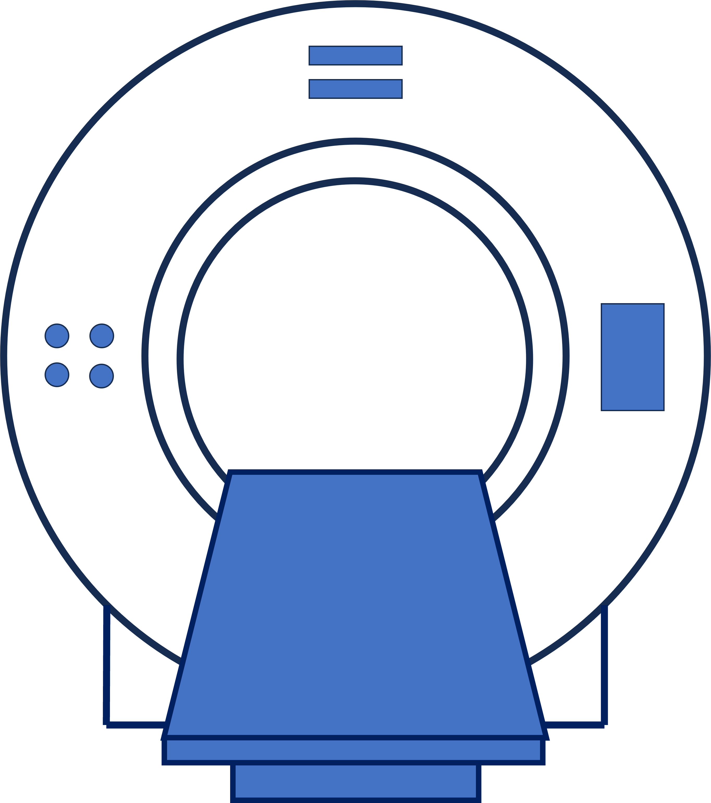

VITools: The Virtual Imaging Trial Orchestrator
=================================================

|build-status|

**VITools** is an orchestration package for conducting Virtual Imaging Trials (VCTs). It serves as a generic, horizontal **adaptor layer** connecting common imaging simulation backends with diverse digital phantoms.

By abstracting away the unique complexities of individual simulation packages, VITools allows researchers to focus on the study design rather than the underlying mechanics of the simulator.

VITools vs. VICTRE
------------------
It is important to distinguish **VITools** from **VICTRE** (Virtual Imaging Clinical Trial for Regulatory Evaluation):

*   **VICTRE** is a **vertical stack**: It is a specific, end-to-end pipeline designed for a specific purpose (mammography/tomosynthesis breast imaging). It tightly couples specific phantom models, compression simulations, and MC-GPU imaging.
*   **VITools** is a **horizontal adaptor layer**: It is a general-purpose infrastructure designed to run *any* compatible simulation backend with *any* compatible phantom. While VICTRE represents a specific application, VITools represents the "operating system" or framework upon which many such applications (including future versions of VICTRE-like pipelines) can be built.

Key Features
------------
*   **Object-Oriented Interface**: Simplifies complex simulations with intuitive `Phantom`, `Scanner`, and `Study` classes.
*   **Extensible by Design**: Easily add new phantoms via a `pluggy`-based plugin system.
*   **Automated Workflow**: Handles the end-to-end process from phantom definition to DICOM image generation.
*   **Scalable Studies**: The `Study` class enables the management and execution of large-scale experiments, with support for parallel execution on SGE clusters.
*   **Configuration-Based**: Leverages the powerful configuration system of the underlying backend (e.g., XCIST) for detailed control.

How it Works
------------
VITools standardizes the VCT workflow into two primary wrapping steps:

1.  **Wrap your Imaging Simulator**: The `Scanner` class wraps a simulation engine (backend), exposing a common API for configuring physics, geometry, and protocols.
2.  **Wrap your Phantom**: The `Phantom` class wraps your digital subject data (numpy arrays, voxel spacing), making it intelligible to the scanner wrapper.

Once these two components are wrapped, VITools handles the "handshake" between them—voxelizing the phantom, generating configuration files, running the simulation, and reconstructing the output—allowing you to run large, complex studies with minimal boilerplate.

Supported Backends & Roadmap
----------------------------
VITools is designed to be backend-agnostic.

**Current Support:**

*   **XCIST (The X-ray CT Image Simulation Toolkit)**: The default backend for VITools.
    *   **Open Source**: XCIST is available under the **BSD 3-Clause License**.
    *   **Validated**: XCIST is a thoroughly validated 3D CT simulation framework.
        *   *Wu et al., "XCIST—an open access x-ray/CT simulation toolkit," Physics in Medicine & Biology, 2022.*
        *   *Zhang et al., "Development and tuning of models for accurate simulation of CT spatial resolution using CatSim," Physics in Medicine & Biology, 2024.*

**Planned / Possible:**

*   **MC-GPU**: Future integrations may include wrappers for MC-GPU (used in VICTRE), allowing users to switch between ray-tracing (XCIST) and Monte Carlo (MC-GPU) backends within the same study definition.

Installation
------------

**For Users:**

To install the latest stable version of VITools, you can install directly from the git repository:

.. code-block:: bash

    pip install git+https://github.com/DIDSR/VITools.git

**For Developers:**

If you plan to contribute to VITools or want to install it in an editable mode, follow these steps:

.. code-block:: bash

    # 1. Clone the repository
    git clone https://github.com/DIDSR/VITools.git
    cd VITools

    # 2. Install in editable mode
    pip install -e .

This will install the package and its dependencies, and any changes you make to the source code will be immediately effective.

Core Concepts
-------------

VITools is built around three core components that represent the key elements of a virtual imaging trial:

1.  `Phantom <https://github.com/DIDSR/VITools/blob/master/src/VITools/phantom.py>`_:
    Represents the subject or object to be imaged. A phantom is defined by a 3D NumPy array of CT numbers (in Hounsfield Units) and the corresponding voxel spacings.

2.  `Scanner <https://github.com/DIDSR/VITools/blob/master/src/VITools/scanner.py>`_:
    Represents the imaging device. It wraps the simulation backend (e.g., XCIST) and is configured with a specific `Phantom`.

3.  `Study <https://github.com/DIDSR/VITools/blob/master/src/VITools/study.py>`_:
    Manages a collection of scans. This class is used to design large-scale experiments, where you might want to vary parameters like phantom type, scanner model, mA, or kVp across many simulations. It can generate study plans and execute them in series or in parallel.

Basic Usage
-----------

Here is a complete example of how to create a simple phantom, simulate a scan, and save the result as a DICOM file.

.. code-block:: python

    import numpy as np
    from VITools import Phantom, Scanner

    # 1. Create a simple phantom
    # A 100x100x100 voxel phantom with a 50x50x50 high-density sphere inside.
    print("Creating a phantom...")
    image_shape = (100, 100, 100)
    img = np.full(image_shape, -1000, dtype=np.int16)  # Air
    center = tuple(s // 2 for s in image_shape)
    radius = 25
    z, x, y = np.ogrid[-center[0]:image_shape[0]-center[0], -center[1]:image_shape[1]-center[1], -center[2]:image_shape[2]-center[2]]
    mask = x*x + y*y + z*z <= radius*radius
    img[mask] = 100  # Set sphere to a value like soft tissue

    # Define voxel spacings in mm (z, x, y)
    spacings = (0.5, 0.5, 0.5)
    phantom = Phantom(img, spacings, patient_name="TestSphere", patientid=1)

    # 2. Initialize the Scanner with the phantom
    # This will prepare the phantom for simulation (voxelization).
    print("Initializing the scanner...")
    scanner = Scanner(phantom, scanner_model="Scanner_Default")

    # 3. Run the scan and reconstruction
    print("Running the simulation...")
    scanner.run_scan(mA=200, kVp=120, views=100)
    scanner.run_recon(fov=250, slice_thickness=1.0)

    # 4. Save the output to DICOM
    print("Writing output to DICOM files...")
    output_dcm_path = "./output/dicom/test_sphere.dcm"
    dcm_files = scanner.write_to_dicom(output_dcm_path)

    print(f"Successfully created {len(dcm_files)} DICOM files in ./output/dicom/")

Interactive Examples
--------------------

For more in-depth, runnable examples of each component, please refer to the following Jupyter notebooks:

*   `01_phantoms.ipynb <https://github.com/DIDSR/VITools/blob/master/notebooks/01_phantoms.ipynb>`_
*   `02_scanners.ipynb <https://github.com/DIDSR/VITools/blob/master/notebooks/02_scanners.ipynb>`_
*   `03_studies.ipynb <https://github.com/DIDSR/VITools/blob/master/notebooks/03_studies.ipynb>`_

Advanced Usage: The `Study` Class
----------------------------------

For more complex experiments, the `Study` class can automate running hundreds or thousands of simulations. You can define a study plan in a CSV file or generate one programmatically.

.. code-block:: python

    from VITools import Study

    # Generate a study plan with 5 different cases
    study_plan = Study.generate_from_distributions(
        phantoms=['MyCustomPhantom'], # Requires a registered custom phantom
        study_count=5,
        output_directory='my_large_study',
        kVp=[100, 120],
        mA=[150, 200, 250]
    )

    # Create a Study object and run all simulations
    # This can run in parallel on a supported cluster (e.g., SGE)
    study = Study(study_plan)
    study.run_all(parallel=True)

Command Line Interface
----------------------
VITools includes a command-line utility for running simulations. The `generate` command runs simulations defined in a CSV file.

For detailed usage, please refer to the `documentation <docs/usage.rst>`_.

Extensibility: Creating Custom Phantoms
---------------------------------------
VITools uses a plugin architecture based on `pluggy` that allows you to create your own phantom generators and make them available to the `Study` class. To create a new phantom, you need to:

1.  Create a new installable Python package.
2.  In your package, create a class that inherits from `VITools.Phantom` (See L6-20 of `examples.py <src/VITools/examples.py>`_).
3.  Register your new phantom class using the `register_phantom_types` hook (See L22-24 of `examples.py <src/VITools/examples.py>`_).
4.  Add plugin entry point to your `pyproject.toml <pyproject.toml>`_ file.

Repositories using `VITools`
----------------------------
The following repositories demonstrate the **phantom-agnostic** nature of VITools, applying the same simulation orchestration to diverse anatomical regions:

-   `InSilicoICH <https://github.com/DIDSR/InSilicoICH>`_: For generating synthetic non-contrast CT datasets of **intracranial hemorrhage (ICH)**.
-   `PedSilicoLVO <https://github.com/brandonjnelsonFDA/PedSilicoLVO>`_: For generating synthetic **large vessel occlusion (LVO)** non-contrast CT datasets.
-   `PedSilicoAbdomen <https://github.com/DIDSR/PedSilicoAbdomen>`_: For generating synthetic **abdominal** non-contrast CT datasets of liver metastases.
-   `InSilicoGUI <https://github.com/DIDSR/InSilicoGUI>`_: Provides a graphical user interface to the phantoms and imaging simulations.

Disclaimer
---------------------

**About the Catalog of Regulatory Science Tools**

The enclosed tool is *in preparation* for the `Catalog of Regulatory Science Tools <https://cdrh-rst.fda.gov>`_. Note that this software is not (yet) a standalone RST but rather is to be included as a **reference tool** to support other Regulatory Science Tools (such as synthetic datasets) for reproducibility.

This catalog collates a variety of regulatory science tools that the FDA's Center for Devices and Radiological Health's (CDRH) Office of Science and Engineering Labs (OSEL) developed. These tools use the most innovative science to support medical device development and patient access to safe and effective medical devices. If you are considering using a tool from this catalog in your marketing submissions, note that these tools have not been qualified as `Medical Device Development Tools <https://www.fda.gov/medical-devices/medical-device-development-tools-mddt>`_ and the FDA has not evaluated the suitability of these tools within any specific context of use. You may `request feedback or meetings for medical device submissions <https://www.fda.gov/regulatory-information/search-fda-guidance-documents/requests-feedback-and-meetings-medical-device-submissions-q-submission-program>`_ as part of the Q-Submission Program.

.. |build-status| image:: https://github.com/DIDSR/VITools/actions/workflows/python-app.yml/badge.svg?branch=master
   :target: https://github.com/DIDSR/VITools/actions/workflows/python-app.yml
   :alt: Package Build and Testing Status

For more information about the Catalog of Regulatory Science Tools, email RST_CDRH@fda.hhs.gov.
